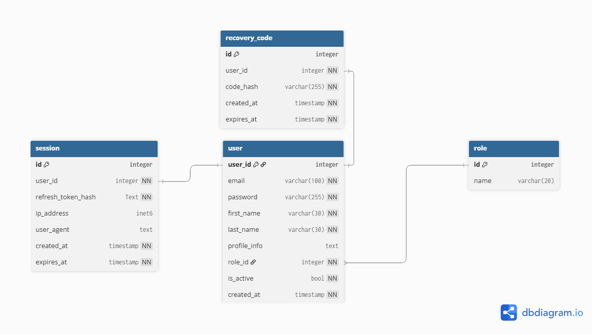

# Endpoints útiles para desarrollo

- **Documentación Swagger/OpenAPI:**
  - Cuando la API esté corriendo, accede a: [http://localhost:3000/swagger](http://localhost:3000/swagger)

- **Visualizar correos enviados (Mailhog):**
  - Cuando Mailhog esté corriendo (por docker-compose), accede a: [http://localhost:8025](http://localhost:8025)

- **API base:**
  - La API escucha en: [http://localhost:3000](http://localhost:3000)

---

# Auth API

Este documento describe los endpoints disponibles en el microservicio de autenticación, así como el modelo entidad-relación utilizado.

## Documentación de Endpoints

La documentación interactiva de los endpoints está disponible en Swagger:

- Ingresa a `/swagger` cuando la API esté corriendo para ver y probar los endpoints.

## Modelo Entidad-Relación

## Roles predefinidos

Según la migración inicial (`migrations/db.sql`), existen tres roles que se crean automáticamente en la base de datos:

| ID lógico | Nombre      |
| --------- | ----------- |
| 1         | user        |
| 2         | admin       |
| 3         | super_admin |

El campo `role_id` en la tabla `users` referencia estos roles. Por ejemplo, un usuario normal tendrá `role_id = 1`.

---

> Para más detalles sobre la implementación, consulta los archivos fuente en la carpeta `src/handlers`.
